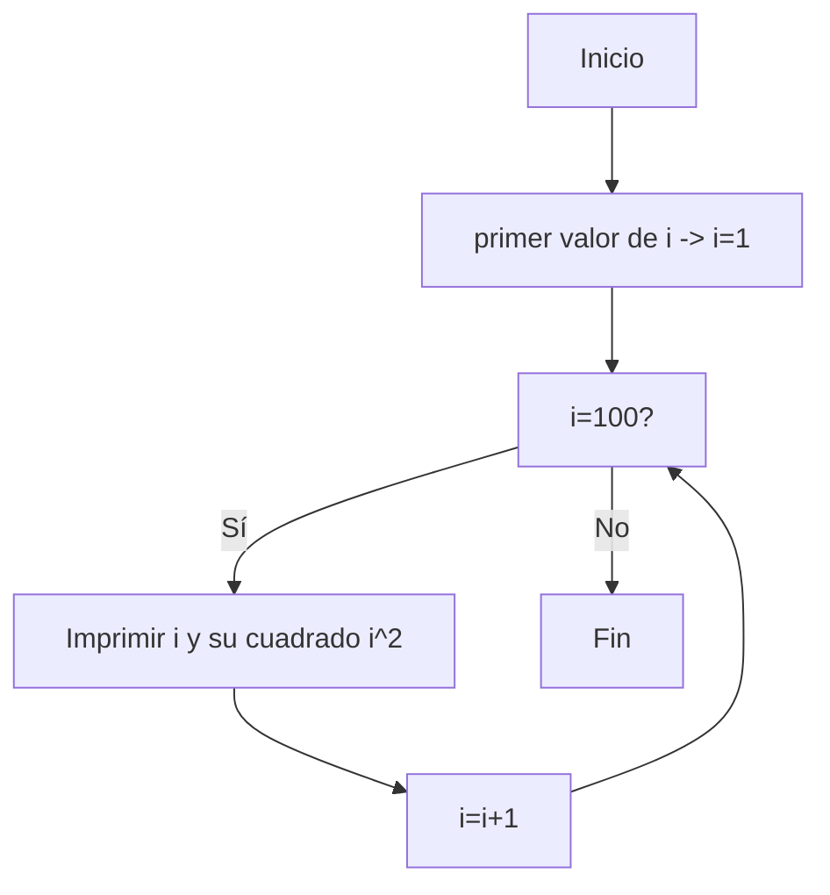
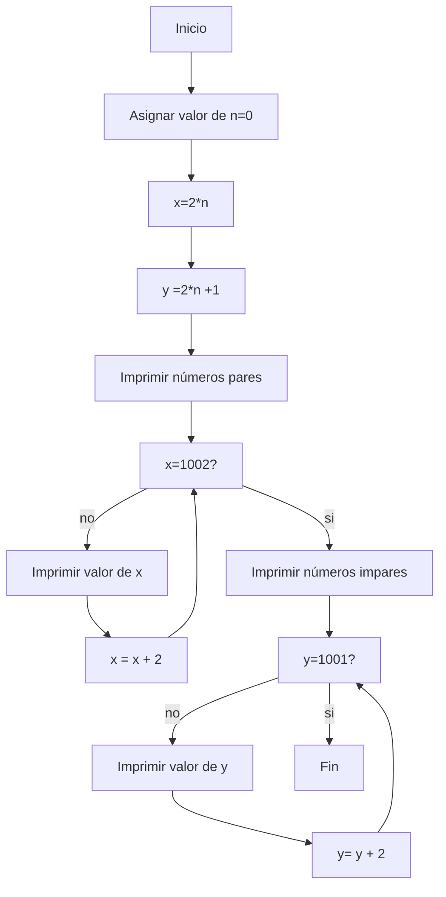
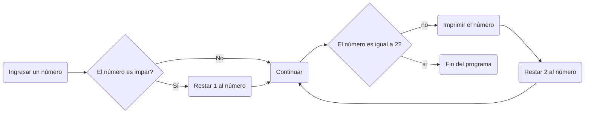

# EL RETO 7...
### Imprimir un listado con los números del 1 al 100 cada uno con su respectivo cuadrado.


```python
i = 1 #Primer valor
while(i <= 100): #Condicional
  print(str(i)+ " y su cuadrado es: " +str(i**2)) #Se imprime el actual "i" y su cuadrado
  i += 1 #Se actualiza
```

### Imprimir un listado con los números impares desde 1 hasta 999 y seguidamente otro listado con los números pares desde 2 hasta 1000.

```python
n = 0 #Valor base
x = 2*n #Esto hace que todas las variables x sean pares
y = 2*n+1 #Esto hace que todas las variables y sean impares
print("Listado de numeros pares desde 1 hasta 1000") #Se imprime para que se vea en donde comienzan los numeros pares
while x <= 1000: #Se imprimira hasta que los numeros pares lleguen a 1000 utilizando el ciclo while
    print(x)
    x +=2 # Se le suma 2, ya que seguira siendo par ejm: 2 + 2 = 4
print("listado de numeros impares desde 1 hasta 1000") #Se imprimera para que se vea donde comienzan los numeros impares
while y <= 999: #Se imprimira hasta que los numeros impares lleguen a 999 utilizando el ciclo while
    print(y)
    y +=2 # se le suma 2, ya que seguira siendo impar ejm: 1 + 2 =3
```

### Imprimir los números pares en forma descendente hasta 2 que son menores o iguales a un número natural n ≥ 2 dado.

```python
x = int(input("Ingrese un numero"))
if x % 2 != 0: #Si el numero no es par se le resta 1, para que se vuelva par
    x -= 1 
while x >= 2: #El condicional hace que el codigo se imprime hasta que llegue a 2
    print(x)
    x -= 2 #Al restarle 2 a un numero par, el resultado va a seguir siendo par 
```



### En 2022 el país A tendrá una población de 25 millones de habitantes y el país B de 18.9 millones. Las tasas de crecimiento anual de la población serán de 2% y 3% respectivamente. Desarrollar un algoritmo para informar en que año la población del país B superará a la de A.


```python
A = 25.0 # inicializa el valor de la poblacion A en 25 millones
B = 18.9 # inicializa el valor de la poblacion B en  18,9 millones
Año = 1 # Año inicial 

while B < A: # El condicional sera mientras B sea menor que A
  print("Año: " +str(Año) + ", Poblacion A: " + str(round(A,2)) + ", Población B "+ str(round(B,2))) # Se imprimen los valores A y B, y la cantidad de años que han transcurrido
  A *= 1.02 # A se multıplica por 1.02, que seria aumentarle un 2% 
  B *= 1.03 # B se multıplica por 1.03, que seria aumentarle un 3% 
  Año += 1 # El año aumenta
  
print("Fin.") # Se imprime al terminar el ciclo while

print("Despues de " +str(Año)+ " años, la segunda poblacion es mayor que la primera, poblacion de A: " +str(round(A,2)) + " Poblacion de B: " + str(round(B,2))) # Se imprimen los ultimos valores y el año en donde ahora  la poblacion B es mayor que la de A
```
### Imprimir el factorial de un número natural n dado.


```python
n = float(input("ingrese un numero ")) #Se ingresa el numero al que se le quiere sacar el factorial
x = n #El valor "x", sera el que multiplicara a la variable "n", y comenzara teniendo el mismo valor que "n"

while x > 1: # El bucle va hasta que "x" llega 1, ya que si llega a 0, todo el bucle daria cero
    print(n) #Se imprimen todos los resultados hasta llegar, al factorial del numero
    x -= 1 #Se resta 1 a la variable "x"
    n *= x # Se multiplica "n" por "x" ejm: Factorial de 4 = (4*4)*(4*3)*(4*2)*(4*1), siendo los numeros 4,3,2,1 la variable x, donde cada vez disminuye una unidad
    
print ("El factorial del numero dado es: " +str(n) ) #Se imprime el ultimo valor de n, que seria el valor factorial
```

### Implementar un algoritmo que permita adivinar un número dado de 1 a 100, preguntando en cada caso si el número es mayor, menor o igual.

```python
x = input("Piensa un número del 1 al 100, y cuando estés listo presiona enter para comenzar: ") #Al precionar la tecla enter comienza el codigo
y = 50 #Se inicializa la variable en el numero 50, porque es el numero que se encuentra en la mitad en el rango de 1 a 100

print("Acaso el número es:" + str(y) + "?") #El codigo comienza preguntando si el numero que piensas es el 50, a partir de eso:

Pregunta = input("El número que estás pensando es igual, poco menor , menor, poco mayor o mayor al que dije?: ")

while Pregunta != str("igual"): #Si se elige que es igual, el codigo se acaba e imprime que se adivino el numero
    if Pregunta == "poco menor": #Si no es igual, y se digita que es menor se resta 1 al valor actual, y se vuelve a preguntar
        y -= 1
    elif Pregunta == "poco mayor": #Si no es igual, y se digita que es mayor se suma 1 al valor actual, y se vuelve a preguntar
        y += 1
    elif Pregunta == "menor": #Se añaden opciones diferentes como poco menor,poco mayor, mayor y menor para avanzar al numero que se piensa algo mas rapido o algo mas lento segun se acerca al numero
        y -= 5
    elif Pregunta == "mayor": #Al digitar mayor o menor se le suma 5 unidades a diferencia de digitar poco menor o poco mayor
        y += 5
    
    print("Acaso el número es:" + str(y) + "?") #Por medio de este print se digita el nuevo numero
    
    Pregunta = input("El número que estás pensando es igual, poco menor , menor, poco mayor o mayor al que dije?: ") #Por medio de este print se vuelve a preguntar

print("¡He adivinado el número!") #Fin del bucle cuando se digita que el numero es igual al pensado
```
### Implementar un programa que ingrese un número de 2 a 50 y muestre sus divisores.


```python
x = int(input("Ingrese un numero mayor o igual a 2 y menor o igual que 50")) #Se ingresa el valor al que se le quiere sacar los divisores, pero debe ser un valor que este entro 2 y 50, incluyendolos
D = 1 #Se inicializa esta variable en 1,Este valor "D" seran los posibles divisores que tiene "x"

if x<2 or x>50: #Si la variable que se ingresa no pertenece al rango establecido se imprime un mensaje notificando eso
    print("El numero no pertenece al rango entre 2 y 50")

while D <= x: #El bucle se termina hasta que "D" tenga el mismo valor que la variable "x"
    if x < 2 or x > 50: #Si la variable que se ingresa no pertenece al rango se rompe la cadena while
        break
    if x % D == 0: # Si el modulo entre "x" y "D", es cero, el valor D es divisor de "x"
        print(str(D)+ " Es divisor de " +str(x)) #Y se imprime que "D" es divisor de "x"
    D += 1 # Se suma el valor de "D", hasta que llegue al valor de "x"
```

### Implementar el algoritmo que muestre los números primos del 1 al 100. nota: use funciones

```python
def calcularprimo(n : int):
    i = 2 # se inicia con i=2, porque todos los numeros son divisibles entre uno, y no tendria sentido comenzar con uno
    if n == 2 : #Se inicia con n = 2
        print(n) #se imprime el valor de n=2, debido a que es el primer primo
    
    while i < n : #El condicional se realiza para todos los i menor que n
        if n % i == 0: #Si el module de n con i es igual a cero, n no es primo y se rompe el ciclo
            break #se rompe el ciclo
        elif i == n-1: #si no se rompe el ciclo, se seguira calculando el modulo de i, hasta que i sea igual a n-1
            print(n)  #Si llega hasta aca significa que n es primo, ya que no es divisible por ningun numero hasta un numero anterior a "n"  y se imprime el valor de n
        i += 1 #Se le suma una unidad a i para seguir probando el modulo entre n, se repite hasta que i sea menor que n

if __name__ == "__main__" :
    
    n = 2 #El valor del primer n
    Limite = 100 #La cantidad de numeros primos que se buscaran va desde 2 hasta 100
    
    while n < Limite: #mientras n sea menor que el limite de 100, se seguira probando por cada numero de la funcion calcularprimo 
        primo = calcularprimo(n) #se llama la funcion primo para hacer lo que pasa dentro de la funcion desde el numero 2 hasta el numero 100
        n += 1 #se le suma 1 a n, despues de cada ciclo hasta llegar a 100.
```
